# ตรวจ design ใหม่ ReportCenter — Mockup v2

วันที่ 2 ต.ค. 2026 · **ตรวจแบบและทดลองเฉพาะข้อมูลจำลอง ยังไม่แก้ mockup หรือระบบจริง**

**สถานะภายหลัง:** ผู้ใช้อนุมัติข้อ 1 แล้ว แก้ F1–F3 ใน local mock และตรวจ regression/browser ผ่านตาม [ผลแก้ข้อ 1](fix-1/README.md) เนื้อหาและภาพด้านล่างเป็นหลักฐาน audit ก่อนแก้; F4/F5/F7 ยังอยู่ ระบบจริงและ Artifact บนเว็บยังไม่ได้เปลี่ยน

ข้อสรุป: โครงสร้างใหม่ช่วยแยกหมวดรายงานกับกลุ่มสิทธิ์ได้ดีขึ้น และทางจากหมวดไปทะเบียนรายงานทำงานต่อเนื่องแล้ว ควรใช้ทิศทางนี้ต่อ แต่ต้องเก็บปัญหาป๊อปอัปและการรักษาข้อมูลระหว่างแก้ไขก่อนใช้แบบเป็นต้นฉบับพัฒนา

## ลำดับงานถัดไปที่แนะนำหลังยืนยันลำดับบริษัท

**ข้อเสนอวันที่ 2 ต.ค. 2026 ยังไม่ใช่คำสั่งให้แก้แบบหรือระบบ:** เริ่มเก็บ mockup กลุ่มสิทธิ์/ผู้ใช้ให้ทดลองงานได้ครบ โดยอิงข้อค้นพบ F1–F5 และขอบเขตระบบจริงใน F7

1. **แก้สิ่งที่ทำให้ทดลองแบบผิดผลก่อน:** ป๊อปอัปต้องคลิกกรอกได้ draft สิทธิ์ต้องอยู่กับกลุ่มที่เริ่มแก้ สร้างกลุ่มว่างแล้วต้องไม่มีสิทธิ์ติดมาจากกลุ่มเดิม และสลับหมวด/กด Esc ต้องไม่ทิ้งข้อมูลที่แก้โดยไม่ได้ยืนยัน (F1–F3)
2. **ทำความหมายหมวด/สิทธิ์ให้ชัด:** หัวรายละเอียดระบุ “หมวด: Account” / “กลุ่มสิทธิ์: Account” พร้อมบอกว่าหมวดใช้จัดรายงาน กลุ่มสิทธิ์กำหนดรายงานที่ผู้ใช้เข้าถึง ส่วนบริษัทเลือกในผู้ใช้ แสดงจำนวน active/inactive แยกกันด้วยขอบเขตเดียวกัน (F5)
3. **เก็บคีย์บอร์ดและทดลองเส้นทางครบ:** แก้ combobox Esc/focus (F4) แล้วลองสร้างกลุ่ม → เลือกรายงานที่อนุญาต → เพิ่มผู้ใช้/เลือกกลุ่มและบริษัท → ดูสรุป รวมยกเลิก/สลับกลุ่มด้วยข้อมูลสมมติ ต้องไม่มีข้อมูลหายหรือสิทธิ์ข้ามกลุ่ม หน้ารายงานมาตรฐานคงเลือกรายงานก่อนบริษัท
4. **เมื่อแบบผ่านจึงกำหนดขอบเขตพัฒนาจริง:** แยกงานหน้าจอจากกติกา API เช่น สิทธิ์บริษัท การเก็บ mapping ของรายงานที่ปิด และการป้องกันผู้ดูแลล็อกตัวเอง รวมตัดสินความต่าง F7 ก่อนลงมือ ภาพ mock ไม่ใช้ยืนยันว่าฝั่งระบบรองรับแล้ว

รอบคำแนะนำนี้ใช้หลักฐาน audit ที่มีอยู่ ไม่ได้ทดลอง browser หรือระบบจริงเพิ่มเติม บันทึก wiki/เอกสารเท่านั้น

## เป้าหมายและขอบเขตหลักฐาน

- ผู้ใช้บอกว่ามี design ใหม่ให้ตรวจ โดยยังไม่ส่ง path เพิ่ม ผู้ตรวจพบชุดล่าสุดจาก wiki `rc-mockups-v2-20261001` และ worktree จึงแจ้งว่าจะตรวจชุดนี้ก่อน
- ต้นทาง: `D:/Antigravity/reportcenter/.claude/worktrees/ui-ux-report-permissions-users-9850aa/docs/design/2026-10-01-mockups-v2/` ไฟล์บางส่วนแก้ล่าสุด 2 ต.ค. 2026 เวลา 09:01 ตามเวลาท้องถิ่นที่อ่านจาก metadata
- **ตรวจไฟล์ local เท่านั้น ไม่ได้ยืนยันว่าเหมือน Artifact version 4 บน claude.ai** ประวัติความต่างเอกสารกับ local และข้อสรุปล่าสุดที่ปิดเรื่องลำดับบริษัทอยู่ F6
- เก็บสำเนา 9 ไฟล์ที่ตรวจใน [source/](source/) และ SHA256 ใน [source-sha256.json](source-sha256.json) เพื่อไม่ให้ผลตรวจเปลี่ยนตาม worktree ภายหลัง
- เปิดผ่าน HTTP เฉพาะ loopback โดยเติม doctype, lang, charset UTF-8 และ viewport ให้ fragment ซึ่ง README ระบุว่า Artifact จะห่อให้ ไม่แก้ไฟล์ต้นทาง ปัญหาตัวอักษรเพี้ยนจากการเปิด fragment ตรง ๆ ถูกแยกออกจากข้อสรุป design
- ใช้ Chrome ตรวจภาพ/DOM และทดลอง workflow ในหน่วยความจำ mock ไม่เชื่อม API/DB/AD ไม่ส่งอีเมล ไม่เปลี่ยนสิทธิ์จริง กลุ่ม `QA ตรวจแบบ` และข้อความทดสอบเป็นข้อมูลจำลอง ล้างด้วย reload หลังตรวจ
- ภาพทั้งหมดในรายงานนี้จับใหม่รอบนี้ ตรวจเดสก์ท็อปที่ขนาดเบราว์เซอร์ปกติ และตัวอย่างจอ 390×844 ในหน้าผู้ใช้/กลุ่มสิทธิ์ คืนขนาดจอเดิมแล้ว ไม่อ้างว่าทดสอบ responsive ครบทุกหน้าหรือ screen reader

## ขั้นตอนที่ตรวจ

| ขั้น | Flow | ผลโดยรวม | ภาพ |
|---|---|---|---|
| 1 | รายงานมาตรฐาน → เปิดตัวเลือก → Esc → เลือก TB Detail | บริษัทปรากฏหลังเลือกรายงาน ตรงกับลำดับที่ผู้ใช้ยืนยันล่าสุด; ยังพบ Esc ไม่ปิด | 01, 02, 03 |
| 2 | หมวดรายงาน → แก้ชื่อ Account → สลับ DC | อธิบายหน้าที่หมวดชัด แต่ draft ชื่อหายทันทีเมื่อสลับหมวด | 04, 05 |
| 3 | หมวด DC → เปิดในทะเบียนรายงาน | ผ่านเส้นทางที่ลอง: มีตัวกรอง DC รายงาน 1 รายการ และปุ่มกลับหมวด | 06 |
| 4 | กลุ่มสิทธิ์ → แก้ Account → เพิ่ม GL Data → เพิ่มกลุ่มว่าง → บันทึก | พบ draft ไปอยู่กับกลุ่มใหม่ และ checkbox ทำ focus หลุด | 07, 08, 09 |
| 5 | ผู้ใช้ → เพิ่มผู้ใช้ AD/Local → กรอก Username → Esc สองครั้ง | แยก Role/บริษัทเข้าใจง่าย แต่ scrim ทับกล่องและ Esc ครั้งที่สองทิ้งข้อมูล | 10, 11, 12 |

ภาพ 13–14 เป็นตัวอย่างมือถือเพิ่มเติม ภาพ 12 แสดงฟอร์มที่กรอกค้าง โดยส่วนคำยืนยันอยู่ต่ำกว่าขอบภาพ; การยืนยัน Esc ใช้ DOM และการกระทำที่สังเกตจริง ไม่อ้างว่าเห็นคำยืนยันครบจากภาพ 12

## จุดที่ดีขึ้นและควรเก็บไว้

- เมนูแบ่ง “จัดการรายงาน” กับ “ผู้ใช้และสิทธิ์”; หน้าหมวดอธิบายว่าการย้ายหมวดไม่เพิ่ม/ถอนสิทธิ์
- ในหมวดเห็นรายการ active/inactive และมีทางไปทะเบียนที่กรองแล้ว ไม่หยุดที่ชื่อรายงานเป็น chip
- หน้ากลุ่มบอกหนึ่งคนอยู่ได้หนึ่งกลุ่ม บริษัทกำหนดในหน้าผู้ใช้ และแยกแท็บรายงาน/สมาชิก
- ฟอร์มผู้ใช้แยก AD/Local, กลุ่มสิทธิ์ และบริษัทที่เข้าถึงได้เป็นส่วนชัดเจน
- ใช้ส่วนประกอบและคำสั่งสอดคล้องขึ้น ป้าย “ใหม่” ช่วยแยกพฤติกรรมที่เสนอจากระบบปัจจุบัน แต่ยังมีบางข้อความต้องแก้ขอบเขตตาม F7

## ข้อค้นพบที่ยืนยันใน browser

### F1 — สำคัญ: พื้นหลังมืดทับกล่องป๊อปอัปและรับคลิกแทนช่องกรอก

เปิดเพิ่มผู้ใช้แล้วกล่องทั้งใบมืดเหมือนพื้นหลัง ตรวจ `elementFromPoint` ตรงกลางช่องค้น AD ได้ `{ topClass: "scrim", topAction: "dlgClose" }` และคลิกตำแหน่งนั้นแล้วป๊อปอัปปิดจริง

สาเหตุจาก source: `core.js:216` วาง scrim กับ dialog-panel เป็นพี่น้อง; `mock.css:305` ให้ scrim z-index 40 แต่ `:319` dialog-panel ไม่มี z-index ภายใน dialog จึงอยู่ใต้ scrim กระทบป๊อปอัปที่ใช้ส่วนกลางนี้

**แนะนำ:** จัดชั้นกล่องเหนือ scrim ให้คลิก/พิมพ์/กดยืนยันได้ตามปกติ แล้วทวนทุก dialog รวมเพิ่มกลุ่ม/ลบ/รีเซ็ต การทดลอง state ของฟอร์มบางรายการรอบนี้ใช้ keyboard หรือ accessibility action จึงทำต่อได้แม้ pointer ถูกทับ ไม่ใช่หลักฐานว่าการคลิกปกติผ่าน

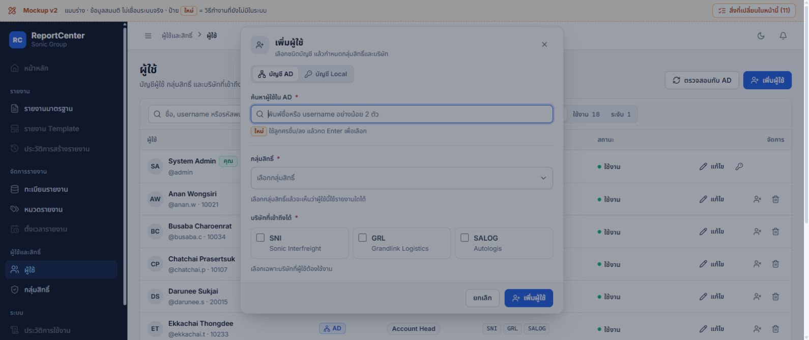

### F2 — สำคัญ: Draft สิทธิ์ของกลุ่มเดิมถูกบันทึกลงกลุ่มใหม่ได้

เริ่ม Account มี 4 รายงาน active และสิทธิ์รายงานปิดอีก 1 → แก้รายงาน เพิ่ม GL Data → กดเพิ่มกลุ่ม → ตั้ง `QA ตรวจแบบ` โดยเลือก “ไม่คัดลอก” → กลุ่มใหม่ขึ้น 0 รายงาน แต่ยังอยู่ในโหมดแก้เดิมและสรุปว่าจะเพิ่ม 6 → กดบันทึกแล้วกลุ่มใหม่ได้ 5 active + 1 inactive จริงใน mock

`page-roles.js:202–209` สร้าง/เลือกกลุ่มใหม่แต่ไม่ล้าง editing/editSel; `:158` บันทึก draft โดยอิงกลุ่มที่เลือกในขณะนั้น

**แนะนำ:** ผูก draft กับรหัสกลุ่มที่เริ่มแก้ และกันการเปลี่ยนบริบททุกทางขณะมีการแก้ค้าง รวมปุ่มเพิ่มกลุ่ม ไม่ใช่กันเฉพาะคลิกกลุ่มในรายการ

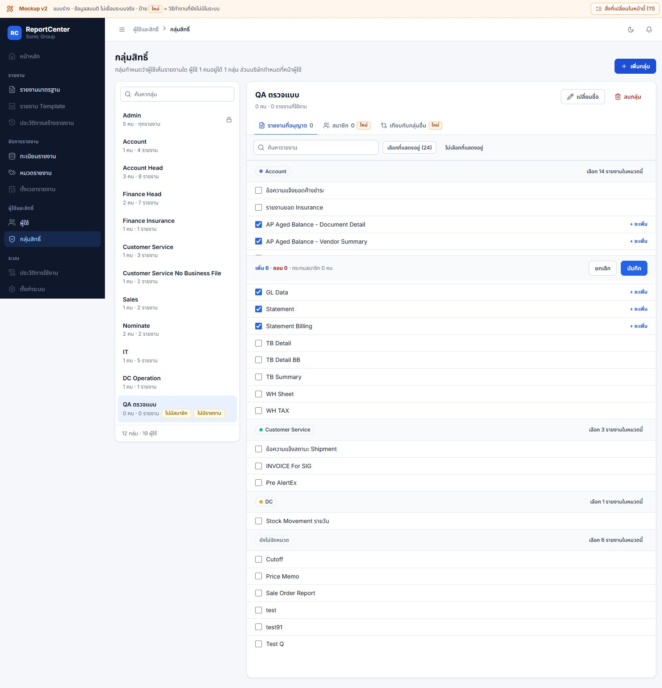

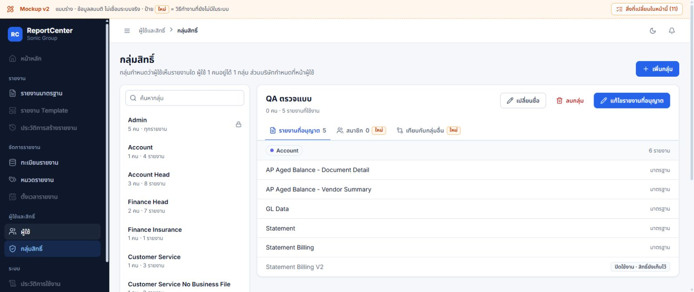

### F3 — ปานกลาง: การทิ้งข้อมูลค้างไม่สม่ำเสมอ

- หมวด: กรอกชื่อใหม่แล้วเลือก DC ฟอร์มหายทันที ไม่มีคำถาม และชื่อ Account เดิมยังอยู่ (`page-categories.js:85`)
- เพิ่มผู้ใช้: กรอก Username → Esc ครั้งแรก DOM แสดง “ยังไม่ได้เพิ่มผู้ใช้ ทิ้งข้อมูลที่กรอกไหม?” พร้อมกรอกต่อ/ทิ้ง → Esc ครั้งที่สองปิดฟอร์มโดยไม่ได้เลือกทิ้ง (`core.js:94–103`)

**แนะนำ:** กำหนดกติกาเดียวกันทุกฟอร์ม เปลี่ยนบริบทให้ถามก่อนทิ้ง; Esc ขณะมีคำยืนยันควรย้อนกลับไปกรอกต่อ ไม่ข้ามการยืนยันแล้วทิ้งข้อมูล

### F4 — ปานกลาง: คีย์บอร์ดยังสะดุด

- เปิด combobox รายงานแล้วกด Esc ยังคง `expanded` และรายการยังแสดงจริง (`page-reports.js:173`; `core.js:303–330,354`) การคืน focus ไปช่องรายงานทำให้ focus handler เปิดรายการกลับ
- Space เลือก GL Data ในหน้าแก้สิทธิ์ได้ แต่ `document.activeElement` กลายเป็น BODY; checkbox ไม่มี id และทุกการติ๊ก render DOM ใหม่ ส่วน restore focus ใช้ id (`page-roles.js:123`; `core.js:303–326`)

**แนะนำ:** แยกการคืน focus จากการสั่งเปิด dropdown และคง focus/scroll ของรายการที่ติ๊ก ทวน Tab/Space/Enter/Esc ต่อเนื่อง ไม่ถือว่าการมี focus ring เท่ากับใช้งานคีย์บอร์ดครบแล้ว

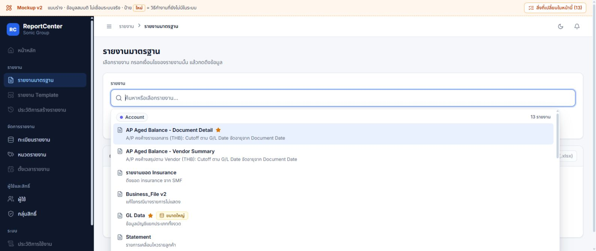

### F5 — ปานกลาง: ชื่อ Account และจำนวนรายงานยังมีโอกาสทำให้สับสน

ทั้งหัวรายละเอียดหมวดและกลุ่มใช้ชื่อ Account ลอย ๆ หน้ากลุ่มแสดง “รายงานที่อนุญาต 4” แต่หัวหมวดภายในระบุ “5 รายงาน” เพราะรวม inactive ต่างขอบเขต แม้มีป้าย inactive ที่แถวท้าย ผู้ใช้ต้องไล่อ่านจึงเข้าใจยอด

**แนะนำ:** หัวรายละเอียดใช้ “หมวด: Account” / “กลุ่มสิทธิ์: Account”; สรุปเดียวว่า “ใช้งาน 4 · ปิดใช้งานแต่เก็บสิทธิ์ 1” และใช้ขอบเขตเดียวกันใน count/tab ไม่จำเป็นต้องรีบเปลี่ยนชื่อข้อมูลจริง

มือถือหน้ากลุ่มเรียงรายชื่อทั้งหมดก่อนรายละเอียด (ภาพ 14) หากเลือกแล้วควรเลื่อนไปส่วนรายละเอียดหรือย่อรายชื่อให้เลือกง่ายขึ้น ประเด็นนี้เป็นข้อเสนอปรับการเดินหน้า ไม่ใช่ข้อสรุปว่าเลย์เอาต์ล้นจอ

## ความต่างระหว่างเอกสาร แบบ และระบบจริง

### F6 — ปิดเรื่องลำดับบริษัท: ผู้ใช้ยืนยันให้เลือกรายงานก่อน

README ใน snapshot รอบ 4 เคยเสนอให้บริษัทเป็นขั้นแรกและเห็นตลอด แต่ local ที่ตรวจแสดงบริษัทหลังเลือกรายงาน (`page-reports.js:63–66,105–107`) **ผู้ใช้ยืนยันภายหลังวันที่ 2 ต.ค. 2026 ให้เลือกรายงานก่อน แล้วค่อยเห็นบริษัท** จึงยึดลำดับ local นี้และถอนข้อเสนอให้แสดงบริษัทก่อน ไม่ต้องเปลี่ยน mock หรือระบบในประเด็นนี้

**ผลเทียบล่าสุด: ตรงกับข้อสรุปผู้ใช้ทั้ง local mock และ source ระบบ** (`src/app/(dashboard)/reports/standard/page.tsx:464–483`) ลำดับคือ เลือกรายงาน → แสดงบริษัทและเงื่อนไขเฉพาะรายงาน → ดึงข้อมูล → ส่งออก ดู `docs/12_DECISION_LOG.md` คง snapshot เดิมไว้เป็นหลักฐานประวัติ ไม่แก้ย้อนหลัง

คำยืนยันนี้ไม่ได้ตัดสินเรื่องปุ่มหรือ dropdown/การจำบริษัทล่าสุด และยังไม่ตรวจ Artifact บนเว็บ จึงไม่อ้างว่าเว็บกับ local เหมือนกันทุกส่วน

### F7 — ต้องระบุพฤติกรรมใหม่ให้ครบ ไม่ให้ดูเหมือนแค่เปลี่ยนหน้าตา

| ประเด็น | แบบ local | Source ระบบจริง / ผลเทียบ | ข้อเสนอ |
|---|---|---|---|
| เงื่อนไขรายงาน | hard-required และ regex ตามชื่อ period (`page-reports.js:194–195`, `data.js:31–38`) | parameters API ไม่มี required/validation rule; standard ถามยืนยันเมื่อเว้นว่าง (`src/app/api/reports/parameters/route.js:47`, `standard/page.tsx:168–178`) — ไม่ตรง/เสนอเพิ่ม | ผูกกติกากับ definition ของแต่ละ Report ไม่สรุปกติกาทุก Report จากชื่อช่อง |
| รูปแบบไฟล์ | ทุกปุ่มเขียน Excel (.xlsx) (`page-reports.js:136`) | ปกติส่ง XLSB; heavy ส่ง CSV (`standard/page.tsx:369`, `execute-async/route.js:201`) — ไม่ตรง | ใช้ชื่อไฟล์ตรงผลจริง หรือระบุว่าเสนอเปลี่ยนชนิดไฟล์ |
| ลบรายงาน | คำยืนยันระบุลบกำหนดการด้วย (`page-reports.js:331`) | DELETE ไม่ลบ ReportSchedules และ schema ไม่มี cascade (`api/admin/reports/[id]/route.js:335–351`, `bulk/route.js:29–40`, `schedules/route.js:32`) — ไม่ตรง | ตกลงว่าจะกันลบหรือจัดการกำหนดการอย่างไร พร้อมแสดงรายการผลกระทบ ไม่รับรองว่าลบตามคำในแบบได้แล้ว |
| รายงานที่ปิดใช้งานในกลุ่ม | เก็บ mapping ไว้ใน mock | GET Roles ระบบจริงคืนเฉพาะ active และ PUT เขียน mapping ใหม่ — เป็น gap ที่ audit เดิมบันทึกแล้ว | ต้องแก้/ทดสอบฝั่ง API ก่อนถือว่ารองรับ |
| บริษัท/กันล็อกตัวเอง/บังคับเปลี่ยนรหัส | แบบแสดงสรุปและ guard บางส่วน | ยังมีข้อค้างจาก audit เดิม — ยังไม่ยืนยัน implementation | แยกแผน API และผลทดสอบจริงจากภาพ/พฤติกรรม mock |

ทั้งหมดข้างต้นไม่ใช่ข้อสรุปว่าอีเมลหรือระบบตั้งเวลาที่ผู้ใช้ยืนยันใช้งานได้มีปัญหา และไม่เปลี่ยนกติกา “ดึงข้อมูล” คือเรียกรายงานจริง ไม่เสนอ stale banner

## ข้อสังเกตเสริม — ระบุชนิดหลักฐานแยกต่อข้อ

- ล้างรายงานระหว่าง callback จำลองกำลังรัน: callback ตั้ง phase done เมื่อ id เป็น null แล้ว stdTable อ่าน id; ทีมตรวจทำซ้ำใน Node VM ที่ stub DOM ได้ TypeError (`page-reports.js:78,128,141,201–205`) ควรผูกผลกับงานที่เริ่ม ไม่ใช่เพิ่มแถบเตือนเงื่อนไข
- เปลี่ยน AD คนที่เลือกแล้ว บริษัทเดิมอาจค้างแต่ hint บอกว่าเลือกตามคนใหม่; แก้ข้อความค้นไม่ล้างบัญชีที่เลือก; mock ยังเพิ่ม AD คนเดิมซ้ำได้ (`page-users.js:152–153,205,212,223–228,239–252`)
- เทียบกลุ่มคิดเฉพาะ active จึงแสดง 100% ได้แม้ mapping inactive ต่างกัน แล้วมีข้อความชวนรวมกลุ่ม (`page-roles.js:5,95`; `core.js:41`) ทีมตรวจยืนยันกรณีจำลองด้วย VM; ควรแสดงขอบเขตและสิทธิ์ inactive ที่ต่างกันก่อนเสนอรวม
- Dropdown ภายใน dialog ถูกวางเป็น DOM sibling นอก aria-modal และ Tab คืน focus ปุ่มเดิม ต้องตรวจ screen reader/focus flow ต่อ (`core.js:206,216,294`)
- รายการโปรดหายเมื่อเลือกรายงานแล้ว เห็นจากภาพ 01/03 และ source `page-reports.js:62` ต่างจากระบบเดิมที่คงรายการโปรดไว้ ควรคงทางสลับรายงานที่ใช้บ่อยให้เข้าถึงง่าย

## Gallery ตามขั้นตอนหลัก

### 1. รายงานมาตรฐาน

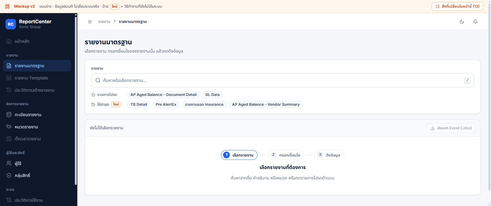
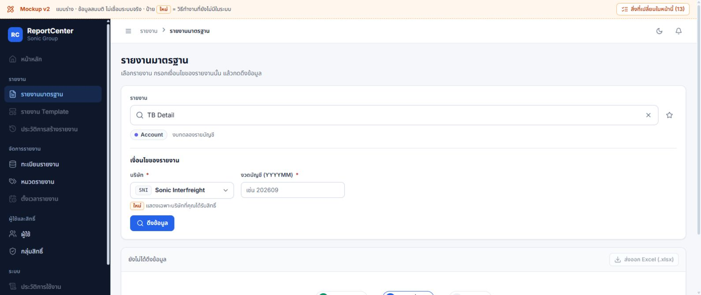

### 2. หมวดรายงาน

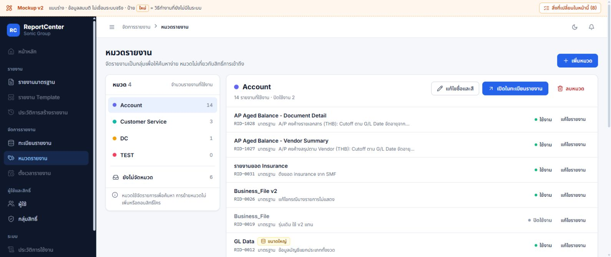
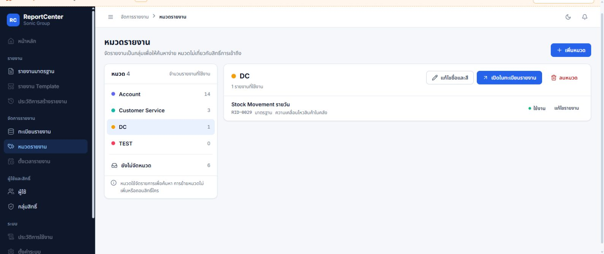

### 3. ทะเบียนรายงาน

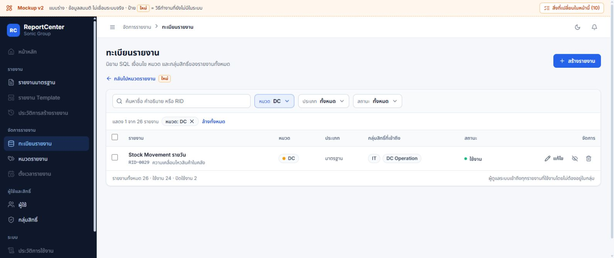

### 4. กลุ่มสิทธิ์

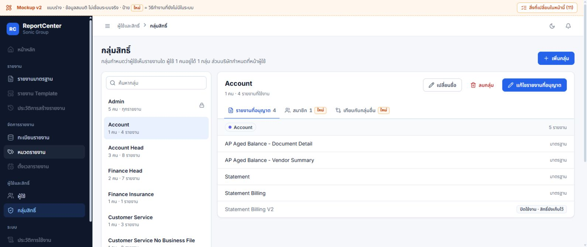

### 5. ผู้ใช้

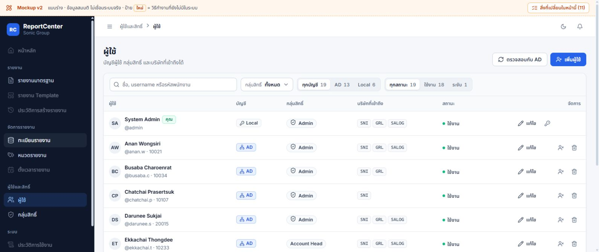
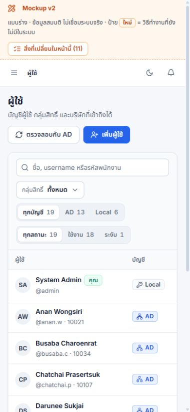
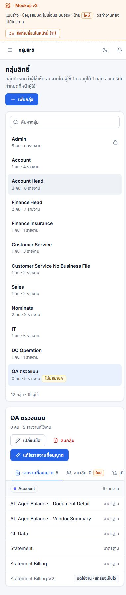

## Sources และขอบเขตการตรวจ

- `source/README.md` — brief/rอบแก้ 1–4 และผลตรวจที่ผู้ทำแบบบันทึกไว้ เป็นข้อมูลประกอบ ไม่ยกมาเป็นผลผ่านของรอบนี้
- `source/index.html`, `mock.css`, `core.js`, `data.js`, `page-reports.js`, `page-categories.js`, `page-users.js`, `page-roles.js` — อ่านจริงและ serve สำเนาเนื้อหาเดียวกันจากต้นทาง ตรวจ hash ตรง
- `DEVELOPER_HANDOFF.md` — หัวข้อ Report Authorization, API/admin/model; ใช้ร่วม source และความต่างใน audit เดิม ไม่รับรองว่า APIs ทั้งหมดครบจากคำอธิบาย
- `docs/12_DECISION_LOG.md`, `docs/audits/2026-10-01-ui-ux/README.md` — รักษาข้อกำหนด workflow ของผู้ใช้และแยกข้อค้าง implementation
- `src/app/(dashboard)/admin/reports/new/page.tsx`, `admin/users/page.tsx`, `admin/roles/page.tsx`, `admin/categories/page.tsx`, `reports/standard/page.tsx` — แบบจำลองและ UI ปัจจุบัน
- `src/app/api/reports/available/route.js`, `execute/route.js`, `execute-async/route.js`, `parameters/route.js`, `src/app/api/admin/roles/route.js`, `reports/[id]/route.js`, `reports/bulk/route.js`, `schedules/route.js` — เงื่อนไขที่เทียบใน F7

ตรวจรอบนี้: source + browser/DOM + ภาพ 14 ภาพ (รวมภาพประกอบที่มีข้อจำกัดระบุไว้) + VM เฉพาะ logic โดยทีมตรวจ; ไม่รัน app tests/build, ไม่ทดสอบระบบจริง/DB/AD/ส่งออก/อีเมล/ตั้งเวลา ไม่รับรอง deployment/UAT หรือ accessibility compliance

ผลข้อเสนอถูกบันทึกใน Obsidian `rc-design-v2-review-20261002` ปิดเรื่องลำดับบริษัทตามคำยืนยันล่าสุดแล้ว ข้อค้าง interaction ยังอยู่ งานรอบนี้ไม่มีการแก้ implementation

ผลตรวจเอกสารรอบนี้: wiki-lint ผ่าน (15 หน้า), shared-lint ผ่าน, git diff --check ผ่าน; SHA256 ของต้นทางและ snapshot ทั้ง 9 ไฟล์ตรงกัน ภาพ 14 ไฟล์และลิงก์ภาพในรายงานมีอยู่จริง ไม่พบ diff ใน src/package.json/next.config.ts ปิดแท็บและเซิร์ฟเวอร์ preview ที่ใช้ตรวจแล้ว

หลังคำยืนยันลำดับบริษัท: แก้ README ต้นทางและเอกสาร/wiki ให้ตรงข้อสรุปใหม่ โดยไม่แก้สคริปต์ mock หรือ source ระบบ; snapshot และ SHA256 ข้างต้นคงเป็นหลักฐาน ณ เวลาตรวจครั้งแรก ไม่ใช่ hash ของ README ต้นทางหลังแก้เอกสาร ตรวจ wiki-lint, shared-lint และ git diff --check ซ้ำผ่าน
