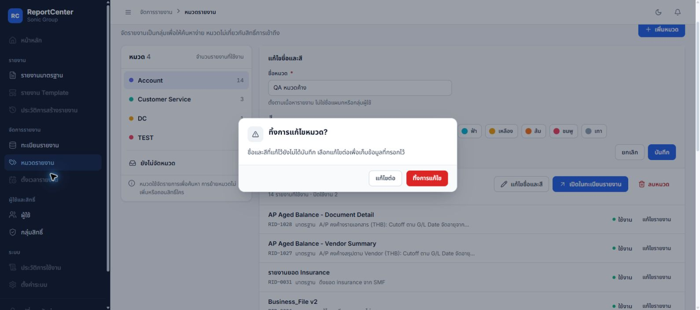
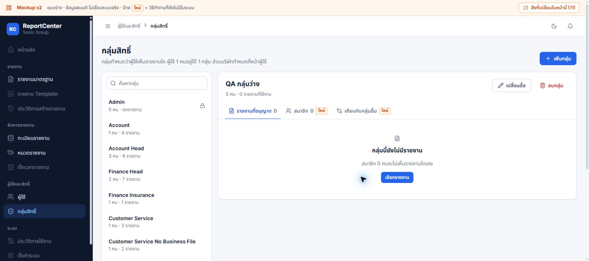
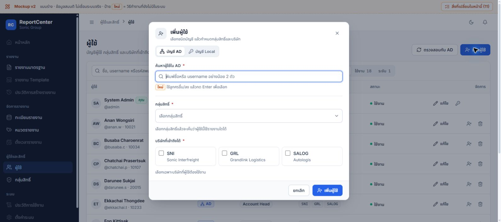

# Mockup v2 — ผลแก้ข้อ 1

วันที่ 2 ต.ค. 2026 · ผู้ใช้อนุมัติ “เริ่มข้อ 1 ได้” · **แก้และตรวจเฉพาะ local mock ยังไม่แก้ระบบจริงหรือ Artifact บนเว็บ**

## สิ่งที่เปลี่ยน

| ข้อเดิม | สาเหตุ / การแก้ | สถานะ |
|---|---|---|
| F1 ป๊อปอัปมืดและช่องกรอกคลิกไม่ได้ | `.scrim` มี z-index 40 แต่ panel ไม่มี; เพิ่ม z-index 41 ให้ panel | ผ่าน hit-test และคลิกจริง |
| F2 draft สิทธิ์ไปอยู่กลุ่มใหม่ | เพิ่มกลุ่มเปลี่ยน selection โดยเก็บ draft เดิม; ตอนนี้ผูก owner `editRoleId`, กันเพิ่ม/ลบ/ออกหน้าขณะ editing และล้าง draft เมื่อเสร็จ | ผ่าน VM + workflow ใน browser |
| F3 หมวดทิ้งชื่อ/สีที่แก้ | เส้นทางเปลี่ยนหมวด/new/cancel/ทะเบียน/delete ล้าง edit ทันที; ใช้คำยืนยันร่วมในหน้าหมวด และ `PAGE_GUARDS` กันออกหน้า | ผ่าน VM + browser สำหรับสลับหมวด/ออกหน้า/เก็บต่อ/ทิ้ง |
| F3 กดปิด/Esc ซ้ำทิ้งผู้ใช้ | closeDialog/closeDrawer เคยปิดเมื่อ confirm เปิดอยู่; ตอนนี้ย้อน confirm กลับไปกรอกต่อ และทิ้งได้ด้วย explicit discard | ผ่าน VM ทั้ง dialog/drawer; browser ตรวจฟอร์มเพิ่มผู้ใช้ |

การเปลี่ยนหน้าในกลุ่มสิทธิ์ใช้ข้อความให้บันทึกหรือยกเลิกก่อน เช่นเดียวกับการเลือกกลุ่มเดิม ส่วนหมวดให้เลือกแก้ไขต่อ/ทิ้งการแก้ไข ไม่ทำ auto-save

ไฟล์ที่แก้ runtime ของ mock: `core.js`, `mock.css`, `page-roles.js`, `page-categories.js` เพิ่ม regression scripts 3 ไฟล์ใน `tests/` ไม่มี diff ใน `src`, `package.json`, `next.config.ts` ทั้ง main/worktree จากการตรวจรอบนี้

## หลักฐานก่อนและหลัง

- ก่อนแก้: DOM hit-test ช่องค้น AD ได้ `scrim/dlgClose` แทน input; หลังแก้ `inputReceivesPointer: true`, panel z-index 41 คลิกช่องแล้ว dialog ยังคงเปิด
- VM ก่อนแก้: role 6/6 และ category 9/9 ไม่ผ่าน; overlay/navigation 3 ไม่ผ่าน อีก 4 กรณีเดิมผ่าน หลังแก้รวม **22/22 ผ่าน** การทดสอบเรียก handler/state ของสคริปต์จริง โดย stub เฉพาะ render/DOM/timer ที่ไม่ใช่ขอบเขตทดสอบ ภาพและ pointer ตรวจแยกใน browser
- `npm test` ครั้งแรกพบ Node tests ถูก Vitest เก็บซ้ำ 3 suites (No test suite found) เปลี่ยนชื่อเป็น `.node.cjs` โดยไม่แก้ config; ครั้งสุดท้าย **8 files / 114 passed / 1 todo**, exit 0
- `node --check` ผ่านทุกไฟล์ JS ของ mock; ไม่รัน build เพราะไม่แก้แอป Next.js หรือ dependency

## ตรวจผ่านเบราว์เซอร์

Environment: Chrome ผ่าน `cua_repl`, `http://127.0.0.1:5194/`, viewport ที่อ่านได้ 1600×709 พิกเซล ใช้ wrapper UTF-8/viewport ชั่วคราวสำหรับ index fragment เช่น audit เดิม ไม่เปลี่ยน index ของ Artifact

Browser plugin แบบแยกไม่มีใน session; ใช้ browser API/Playwright locators ที่มีอยู่ใน `cua_repl` ไม่ติดตั้ง browser/dependency ใหม่ ครั้งแรก reload ยังได้ CSS จากแคช จึงใช้ CDP `Page.reload` พร้อม `ignoreCache: true` แล้วตรวจ computed style ใหม่

| ขั้นตอน | ผลที่ยืนยัน |
|---|---|
| ผู้ใช้ → เพิ่มผู้ใช้ → คลิกค้น AD → เลือก Local | ช่องรับคลิกและสลับชนิดบัญชีได้ |
| กรอก Username จำลอง → Esc → Esc | ครั้งแรกถามก่อนทิ้ง ครั้งที่สองกลับฟอร์มและยังมีค่าที่กรอก |
| Esc → กด “ทิ้ง” | dialog ปิดตามคำสั่งชัดเจน |
| หมวด Account → แก้ชื่อ → เลือก DC → แก้ไขต่อ | ชื่อที่แก้ยังอยู่ ไม่เปลี่ยนหมวด |
| เลือก DC → Esc | ปิดเฉพาะคำยืนยัน เก็บ draft |
| กดเมนูผู้ใช้ระหว่างแก้หมวด | URL คง `#categories` จนกดยืนยันทิ้ง แล้วจึงไป `#users`; กลับมาชื่อ Account เดิมยังอยู่ |
| แก้สิทธิ์ Account เพิ่ม GL Data → เพิ่มกลุ่ม/ออกหน้า | แจ้งให้บันทึกหรือยกเลิก อยู่ `#roles`, draft ยังอยู่ ไม่มี modal สร้างกลุ่ม |
| ยกเลิก draft → เพิ่มกลุ่ม QA แบบไม่คัดลอก | ได้ 0 คน/0 รายงาน ไม่มี draft เดิมติดมา |
| เลือก GL Data ให้กลุ่ม QA → บันทึก → กลับ Account | กลุ่ม QA มี 1 รายงาน; Account ยังคง 4 active + 1 inactive |
| รายงานมาตรฐาน → เลือก TB Detail | บริษัทปรากฏหลังเลือกรายงานตามข้อสรุปล่าสุด |

| การตรวจหน้าจอ | ผล |
|---|---|
| URL/title และเนื้อหาหน้า | ผ่าน: ReportCenter Mockup v2 และ route ตามงาน |
| หน้าเปล่า / framework error overlay | ไม่พบ |
| Console error/warn | ไม่พบจาก logs ของแท็บรอบนี้ |
| ภาพและ interaction | ภาพหลังแก้ 3 ภาพ พร้อม DOM/state ตามตาราง |

คำสั่งหลักจากราก worktree:

```powershell
node --test docs/design/2026-10-01-mockups-v2/tests/*.node.cjs
npm test
Get-ChildItem docs/design/2026-10-01-mockups-v2/*.js | ForEach-Object { node --check $_.FullName }
```

## ขอบเขตและงานที่ยังเหลือ

ไม่ทดสอบ DB/AD/API/อีเมล/ตั้งเวลาจริง ไม่ใช่ deployment/UAT ไม่มีการเพิ่มบัญชีหรือสิทธิ์จริง ข้อมูล QA อยู่ในหน่วยความจำ mock เท่านั้น การแก้ drawer ทวนด้วย VM ส่วน browser รอบนี้ตรวจ dialog เพิ่มผู้ใช้ ไม่ครอบคลุมทุก drawer/form

ยังไม่แก้ F4 (combobox Esc/focus), F5 (ชื่อ/จำนวน/มือถือ), F7 (พฤติกรรมที่ต่างจาก API) หรือ source-only findings อื่น ไม่ทดสอบมือถือ/screen reader ใหม่รอบนี้ อีเมล/ตั้งเวลาคงคำยืนยันเดิมว่าใช้งานได้

ต้นทางที่แก้: `D:/Antigravity/reportcenter/.claude/worktrees/ui-ux-report-permissions-users-9850aa/docs/design/2026-10-01-mockups-v2/` เก็บ snapshot หลังแก้พร้อม tests ใน [source/](source/) และ [source-sha256.json](source-sha256.json) แยกจาก snapshot audit เดิมซึ่งไม่แก้ย้อนหลัง

ตรวจเอกสารปิดงาน: wiki-lint ผ่าน 15 หน้า, shared-lint ผ่าน, git diff --check ผ่านทั้ง main/worktree; snapshot 12 ไฟล์ hash ตรงต้นทาง และรันทดสอบจาก snapshot ผ่าน 22/22 ด้วย Reload ล้างข้อมูล QA และปิดแท็บ/เซิร์ฟเวอร์ preview แล้ว

## ภาพหลังแก้




