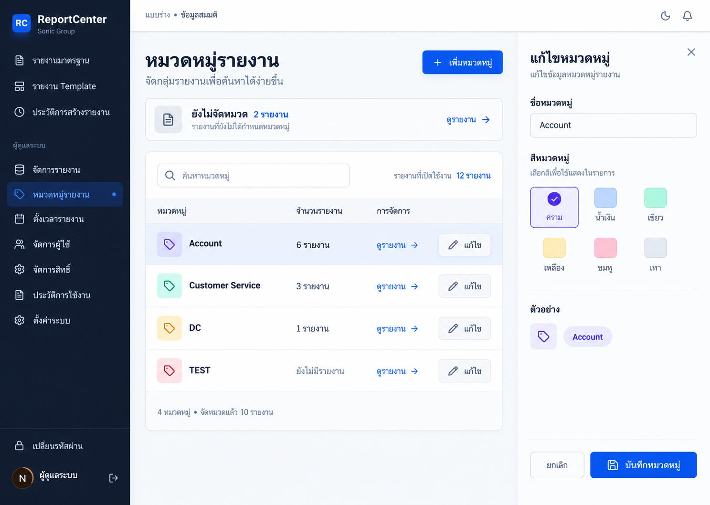
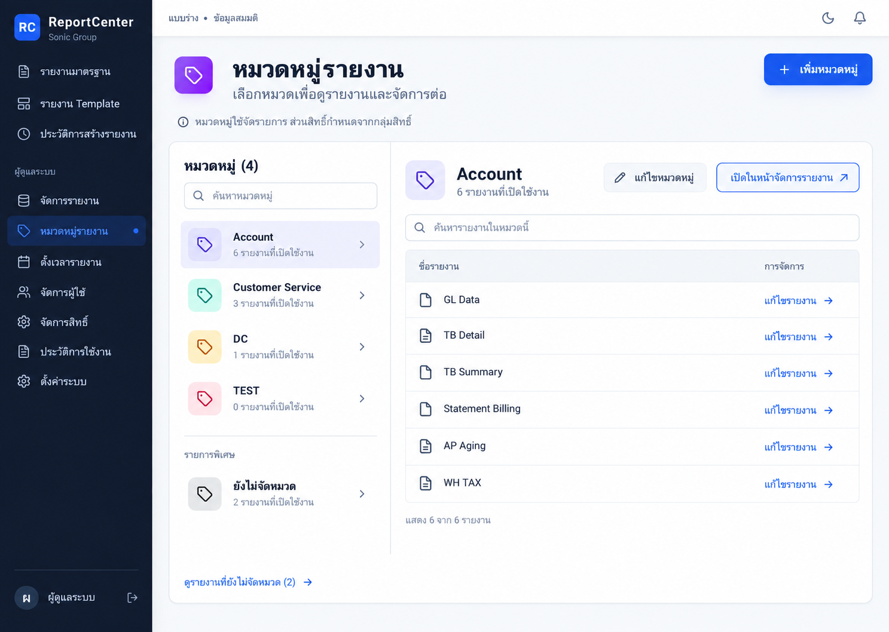
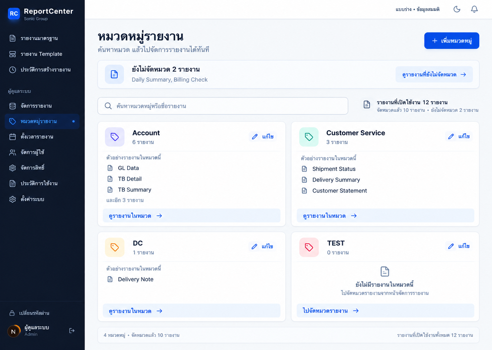

# ReportCenter — Mockup หมวดหมู่รายงาน

วันที่ 1 ต.ค. 2026 · **สถานะ: ข้อเสนอภาพนิ่ง 3 แบบ รอเลือก/ปรับ ยังไม่ implement**

ผู้ใช้ขอดู mockup หมวดหมู่ต่อจากชุดสิทธิ์ และระบุให้ใช้ UI/UX Pro Max จึงทวนหน้าจอเดิม Handoff และ source ก่อนสร้างภาพอิสระ 3 ภาพ ใช้ข้อมูลสมมติ ไม่มีการแก้ระบบหรือบันทึกข้อมูลจริง

## เป้าหมายและกติกาเดิม

- ให้ดูได้ว่าหมวดมีรายงานอะไร และไปจัดการรายงานต่อจากบริบทนั้นได้ ลดการจำขั้นตอนจากข้อความช่วยเหลือ
- หนึ่งรายงานมีหนึ่งหมวดหรือไม่ระบุหมวด การจัดหมวดจากหน้าสร้าง/แก้ Report มีอยู่แล้ว
- หมวดมีชื่อและสี ใช้จัดรายการ ไม่เพิ่มสิทธิ์ตามหมวด ไม่เพิ่มหลายหมวดต่อรายงานหรือหมวดซ้อน
- “ยังไม่จัดหมวด” เป็นมุมมองรายงาน ไม่ใช่หมวดจริงที่แก้ชื่อ/สีหรือลบได้
- คง sidebar navy, พื้น slate อ่อน, ปุ่มสีน้ำเงิน และชื่อหมวดพร้อมสีประกอบ ลดการใช้สีเป็นตัวสื่อความหมายเพียงอย่างเดียว
- คง workflow เรียกรายงานจริง เงื่อนไขเฉพาะ Report และระบบอีเมล/ตั้งเวลาที่ผู้ใช้ยืนยันว่าใช้งานได้ งานรอบนี้ไม่เปลี่ยนส่วนเหล่านั้น

## การใช้ UI/UX Pro Max

ใช้ skill ที่ `C:/Users/Eltross/.codex/skills/ui-ux-pro-max/SKILL.md` เป็นแนวทางออกแบบเฉพาะหน้าที่มีอยู่ ไม่สร้าง design system ใหม่และไม่ติดตั้งแพ็กเกจ

| การค้นฐานแนวทางของ skill | ผลอันดับแรกที่ตรวจว่าเกี่ยวข้อง | การนำมาใช้ |
|---|---|---|
| `admin category navigation deep linking` / domain `ux` | Navigation — Deep Linking; URLs reflect current state | เสนอให้ปุ่มเปิดหน้าจัดการรายงานส่งต่อหมวดที่เลือก และเก็บตัวกรองใน URL เมื่อพัฒนา |
| `color status labels accessibility` / domain `ux` | Accessibility — Color Only | ชื่อหมวดต้องอ่านได้ สีเป็นข้อมูลเสริม; ตัวเลือกสีมีชื่อและเครื่องหมายเลือก |

อ่าน quick-reference ด้าน accessibility เพิ่มเพื่อกำหนดหลัก labels, contrast และ focus; ยังไม่รับรอง keyboard, screen reader หรือ contrast ของระบบจากภาพนิ่ง

## ภาพตามลำดับที่แสดงในแชต

ข้อมูลสมมติร่วมกันทั้งสามแบบ: Account 6, Customer Service 3, DC 1, TEST 0 และยังไม่จัดหมวด 2 รวมรายงานเปิดใช้งาน 12 รายการ จัดหมวดแล้ว 10 รายการ ไม่ใช่จำนวนจากฐานจริง ภาพมีป้าย “แบบร่าง • ข้อมูลสมมติ”

### 1 — ตารางหมวดพร้อมพื้นที่แก้ไข

ตารางเปรียบเทียบชื่อและจำนวน มีคำสั่งดูรายงาน/แก้ไขแยกชัด แสดงฟอร์มชื่อและสีด้านข้างพร้อมปุ่มบันทึกหมวดหมู่ เหมาะกับงานดูแลชื่อและสีหลายหมวด แถบยังไม่จัดหมวดแยกจากรายการหมวดจริง

### 2 — รายชื่อหมวดและรายงานข้างกัน

เลือกหมวดจากรายการด้านซ้าย ด้านขวาแสดงรายงานเป็นแถวพร้อมทางไปแก้รายงานและเปิดหน้าจัดการรายงานที่กรองหมวดแล้ว เหมาะกับการตรวจว่ารายงานแต่ละหมวดมีอะไร โดยรักษาบริบทที่เลือก

### 3 — สารบัญหมวดแบบการ์ด

เห็นตัวอย่างชื่อรายงานในแต่ละหมวดก่อนเปิดดูทั้งหมด เหมาะกับจำนวนหมวดไม่มาก หมวดว่างมีทางไปจัดหมวดรายงาน ส่วนยังไม่จัดหมวดเป็นแถบแยกด้านบน

## พฤติกรรมที่เสนอเพิ่มและเรื่องที่ยังค้าง

1. ปุ่มดูรายงานและทางไปแก้จากหมวดเป็นข้อเสนอใหม่: หน้าเดิมแสดงชื่อรายงานเป็น chip ที่ไม่ใช่ลิงก์ ส่วน Reports มีตัวกรองหมวดอยู่แล้วแต่ยังเก็บเป็น state ไม่อ่านตัวกรองจาก URL ต้องทำการส่งต่อ/คืนค่าบริบทเพิ่มเมื่อ implement
2. ข้อมูลยังไม่จัดหมวดและยอดรวม 12 ในภาพต้องประกอบจากข้อมูลรายงานเพิ่มเติม API categories ปัจจุบันส่งเฉพาะรายงาน active ที่มีหมวด จึงห้ามถือว่ามีข้อมูลนี้ครบใน payload เดิม
3. ช่องค้นหาหมวด/รายงานภายในหมวดและการค้นข้ามตัวอย่างชื่อรายงานในภาพ 3 เป็น interaction ที่เสนอ ไม่มีในหน้าหมวดปัจจุบัน
4. API categories นับเฉพาะ active แต่ DELETE ถอนหมวดจากรายงานทั้งหมดรวม inactive ภาพจึงระบุขอบเขต active และไม่แสดง confirmation ลบที่อ้างยอดผิด ต้องออกแบบคำยืนยันโดยทราบผลกระทบทั้งหมดก่อนทำงานลบ ไม่ถือว่าแก้ข้อสังเกตนี้แล้ว
5. การลบหมวดไม่ลบรายงาน การลบไม่ได้แสดงในภาพชุดนี้ ต้องเก็บเป็นคำสั่งรองพร้อมคำยืนยันหากนำแบบไปพัฒนาต่อ
6. ภาพ 2 ใช้ประโยคย่อว่า “สิทธิ์กำหนดจากกลุ่มสิทธิ์” เป็นคำอธิบายแยกหน้าที่หมวด ไม่ใช่ข้อสรุปสิทธิ์ทั้งหมด; เมื่อนำไปใช้จริงต้องทวนถ้อยคำให้ครอบคลุม Admin/Public/company ตาม audit
7. ยังไม่มีแบบที่ผู้ใช้เลือก ไม่มี bulk move, drag-and-drop หรือการจัดหมวดตรงในตารางเพิ่ม ภาพแสดงทางไป workflow แก้ Report เดิม

## Sources และผลเทียบ

| Source | ข้อเท็จจริงที่ทวน / ผล |
|---|---|
| DEVELOPER_HANDOFF.md — โครงสร้าง categories, ตาราง ReportCategories และ API | ตรง: CRUD ชื่อ/สี รายการรายงานในหมวด และลบแล้วถอนหมวด; เอกสารสรุปไม่ได้แจกแจงขอบเขต active เทียบผลลบทั้งหมด |
| docs/audits/2026-10-01-ui-ux/README.md — F5 และลำดับปรับปรุง | ตรงกับ source ที่อ่านซ้ำ: chip ไม่เชื่อมไปแก้/กรอง และควรเปิดทางไปจัดการต่อ |
| src/app/(dashboard)/admin/categories/page.tsx:105,211,265,294 | ตรง: ใช้ ReportCount ในคำยืนยันลบ, แถวขยาย, chip เป็น span และคำแนะนำเป็นข้อความ |
| src/app/api/admin/categories/route.js:41,50,106,140 | ตรง: counts/list เฉพาะ active, แก้ชื่อ/สี, DELETE ถอน CategoryId โดยไม่กรอง IsActive; ความต่างยอดนับกับผลลบยังค้าง |
| src/app/(dashboard)/admin/reports/page.tsx:30,93 | ตรง: ตัวกรอง all/none/category มีอยู่แล้ว แต่ state เริ่ม all ไม่ได้อ่าน URL |
| src/app/(dashboard)/admin/reports/new/page.tsx:260 | ตรง: dropdown เลือกหมวดเดียวหรือไม่ระบุ |
| src/app/(dashboard)/admin/reports/[id]/edit/page.tsx:252,385 | ตรง: บันทึก CategoryId เดียวหรือ null และมี dropdown แก้หมวด |
| docs/12_DECISION_LOG.md | คง workflow เรียกรายงานและเงื่อนไขเฉพาะ Report |

ภาพระบบจริงที่เปิดตรวจและแนบให้ Image Gen ทุกครั้ง:

- ../../audits/2026-10-01-ui-ux/all-pages/14-categories.jpg
- ../../audits/2026-10-01-ui-ux/05-category-detail.jpg
- ../../audits/2026-10-01-ui-ux/06-category-editor.jpg

## ผลตรวจรอบนี้

- สร้างด้วย Image Gen 3 ครั้งอิสระ เปิดตรวจผลทั้ง 3 ภาพ: ชื่อหมวด/ยอด 6+3+1+0 และยังไม่จัดหมวด 2 สอดคล้องกัน; ภาพ 2 แสดงรายงาน Account ครบ 6 แถว; ภาพ 3 แยกหมวดว่างจากยังไม่จัดหมวด
- คำอธิบายและตำแหน่ง UI เป็นแนวทางภาพ ต้องทำข้อความจริงและ interaction ต่อเมื่อผู้ใช้เลือกแบบ ไม่ใช่เว็บที่กดใช้งานได้
- เก็บสำเนาใน repo และคงต้นฉบับที่ Image Gen สร้างไว้ ตรวจ SHA256 สำเนาเทียบต้นฉบับ
- งานภาพ/เอกสาร: ตรวจโครงสร้างและ sources ใน wiki รวม shared-lint; ไม่รัน app tests/build หรือเชื่อม DB รอบนี้ ไม่อ้างผล deployment/UAT

ชุดก่อนหน้า: [Mockup สิทธิ์/ผู้ใช้](../2026-10-01-permissions-mockups/README.md) · [กลับสารบัญเอกสาร](../../README.md)

## ข้อเสนอต่อเนื่อง — ลดความสับสนระหว่างชื่อหมวดและสิทธิ์

ผู้ใช้ถามต่อว่าจะแก้ความงงเรื่องชื่อหมวดกับสิทธิ์อย่างไร ข้อเสนอต่อไปนี้ยังรอพิจารณา ไม่ใช่การเลือกภาพหรืออนุมัติเปลี่ยนชื่อข้อมูลจริง

ต้นเหตุจาก source: Sidebar ใช้ “จัดการสิทธิ์ (Roles)”, Users ใช้ “Role”, ฟอร์ม Report ใช้ “ระบุตามตำแหน่ง” และ “ระบุตำแหน่งที่เข้าถึงได้” ทั้งที่เป็นความสัมพันธ์ Role เดียวกัน ความคล้ายของหน้ารายการหมวด/กลุ่มสิทธิ์และชื่อที่อาจเป็นชื่อฝ่ายเหมือนกันยิ่งทำให้ดูเหมือนสองหน้าจัดกลุ่มแบบเดียวกัน

| ส่วน | คำที่เสนอใช้สม่ำเสมอ | ความหมาย / ตัวอย่างสมมติ |
|---|---|---|
| Category | หมวดรายงาน | จัดตามเนื้อหา เช่น “การเงินและบัญชี”, “การขนส่ง” |
| Role | กลุ่มสิทธิ์ผู้ใช้ | กำหนดชุดรายงานให้ผู้ใช้ เช่น “ผู้ใช้รายงานบัญชี”, “ผู้ตรวจสอบ” |
| ฟอร์ม User | กลุ่มสิทธิ์ของผู้ใช้ | เลือกหนึ่งกลุ่มตามแบบจำลองปัจจุบัน |
| ฟอร์ม Report | กลุ่มสิทธิ์ที่เข้าถึงรายงานนี้ | เลือกได้หลายกลุ่ม ไม่ใช้คำว่า “ตำแหน่ง” |
| User company scope | บริษัทที่เข้าถึงได้ | แยกจากหมวดและ Role; การบังคับใช้ยังมีข้อค้างตาม audit |

ไม่แนะนำเปลี่ยนชื่อ Category เป็น “ประเภทรายงาน” เพราะระบบมี ReportType มาตรฐาน/ข้อความอยู่แล้ว และไม่เสนอเปลี่ยนข้อมูลทุกหมวดให้ตรงชื่อแผนก ชื่อ DC/ชื่อภายในต้องยืนยันความหมายก่อนเปลี่ยน ชื่อ Admin ภายในถูกใช้ตรวจสิทธิ์ จึงไม่เปลี่ยนเป็นภาษาไทยในฐานจากงานปรับถ้อยคำ; ใช้ชื่อแสดงผลแยกได้เมื่อพัฒนา

การจัดหน้าที่เสนอ:

1. วาง “หมวดรายงาน” ใกล้ “จัดการรายงาน” และ “กลุ่มสิทธิ์ผู้ใช้” ใกล้ “จัดการผู้ใช้” ให้ตำแหน่งเมนูสะท้อนงาน
2. หน้าหมวดใช้ตารางชื่อหมวด/จำนวนรายงาน/ดูรายงาน; หน้ากลุ่มสิทธิ์เน้นชื่อกลุ่ม/จำนวนผู้ใช้/รายงานที่อนุญาต/สมาชิก ไม่ใช้การ์ดขยายเหมือนกันทั้งสองหน้า และไม่ใช้สีอย่างเดียวแยกหน้าที่
3. หน้า Report แยกหัวข้อ “การจัดหมวด” ออกจาก “ผู้ที่เข้าถึงรายงานได้” พร้อมสรุปชื่อกลุ่มที่เลือก หน้า User สรุปรายงานจากกลุ่มสิทธิ์โดยไม่ให้เลือกหมวดเป็นสิทธิ์
4. ข้อความใต้ช่องหมวด: “ใช้จัดรายการเพื่อค้นหา การเปลี่ยนหมวดไม่เปลี่ยนสิทธิ์การเข้าถึง” ชื่อกลุ่มสิทธิ์ต้องมีบริบทนำหน้า ไม่แสดงป้าย “บัญชี” ลอย ๆ จนไม่รู้ว่าเป็นหมวดหรือกลุ่ม
5. หากหน้ากลุ่มสิทธิ์แบ่งรายงานตามหมวดและมีเลือกทั้งกลุ่ม ให้เขียน “เลือก 6 รายงานในหมวดนี้” เพื่อสื่อว่าเลือกเป็นรายงาน ไม่ใช่ให้สิทธิ์หมวด รายงานที่เพิ่มเข้าหมวดภายหลังไม่ได้รับสิทธิ์ตามหมวดอัตโนมัติ

ตัวอย่างสมมติ: GL Data อยู่หมวด “การเงินและบัญชี” และอนุญาตกลุ่ม “ผู้ใช้รายงานบัญชี” กับ “ผู้ตรวจสอบ” คนในกลุ่มผู้ตรวจสอบจึงไม่จำเป็นต้องเป็นฝ่ายบัญชี และการย้าย GL Data ไปหมวดอื่นไม่เพิ่ม/ถอน ReportRoleMapping

**เงื่อนไขก่อนนำไปใช้จริง:** ตัวเลือก “ทุกคน (Public)” ในฟอร์มขัดกับเส้นทาง available/execute ที่ตรวจ mapping สำหรับผู้ใช้ทั่วไป โดยไม่ใช้ IsPublic ในเงื่อนไขที่ตรวจ ต้องตกลงความหมายและทวนผลจริงก่อนแสดงสรุปว่า “ทุกคนเข้าถึงได้” ส่วน Admin เป็นข้อยกเว้นที่ source ตรวจจาก roleName แยกต่างหาก งานถ้อยคำยังไม่ใช่การแก้สิทธิ์ให้ทำงานครบ

หลักฐานเพิ่มเติมที่อ่านรอบนี้:

- `src/components/layout/Sidebar.tsx:17,20` — ชื่อเมนูปัจจุบัน
- `src/app/(dashboard)/admin/users/page.tsx:933,937,950` — Role เดียวและบริษัทแยก
- `src/app/(dashboard)/admin/reports/new/page.tsx:248,254,280` — Public/Role และคำ “ตำแหน่ง”
- `src/app/api/reports/available/route.js:49,67` — Admin เห็น active; ผู้ใช้ทั่วไปผ่าน mapping
- `src/app/api/reports/execute/route.js:59,64` และ `src/app/api/reports/execute-async/route.js:112,117` — Admin bypass และ Role mapping
- `DEVELOPER_HANDOFF.md` หัวข้อ Report Authorization — ตรงกับ mapping ในเส้นทางที่ตรวจ; ข้ออ้างครอบคลุมทุก API ยังต้องอ่านร่วม audit

UI/UX Pro Max รอบนี้ไม่พบคำแนะนำเรื่องคำศัพท์ที่ตรงจากการค้นและลองแคบลง จึงใช้หลักทั่วไปเรื่อง label/ความชัดของหน้าที่ร่วมกับ source เป็นข้อเสนอออกแบบ ไม่อ้างว่าชื่อไทยเหล่านี้เป็นผลจากฐานของ skill
