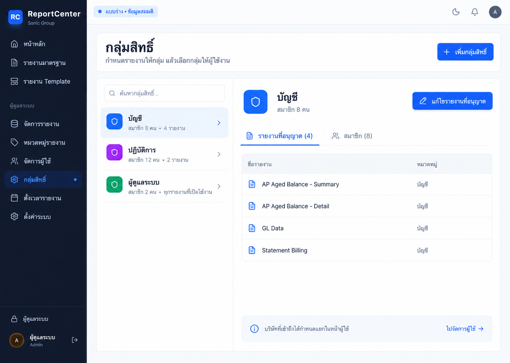
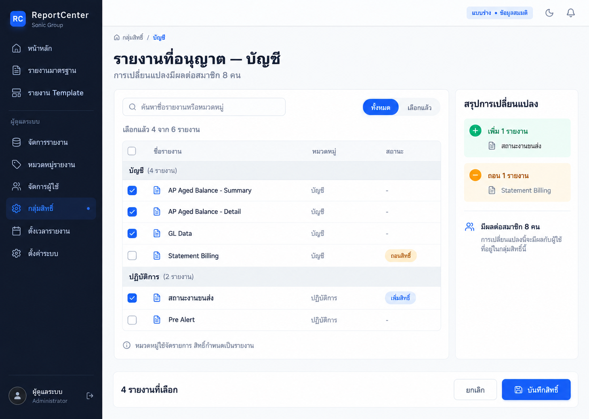
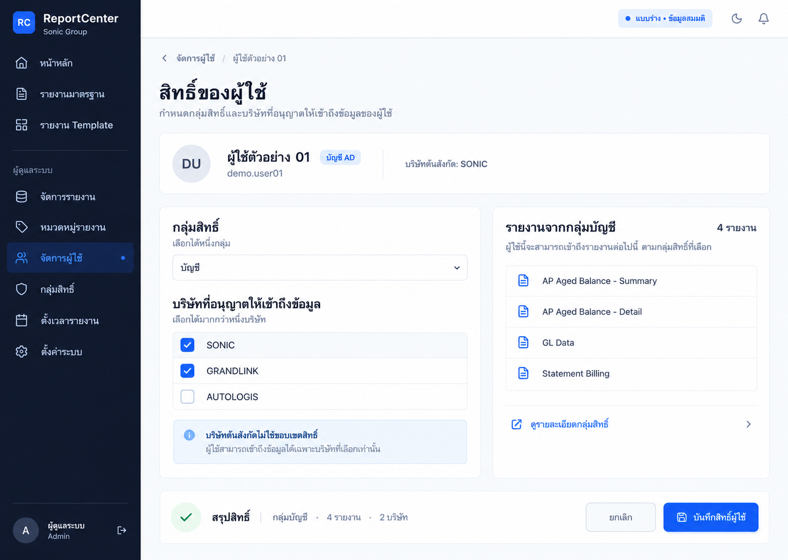

# ReportCenter — Mockup กลุ่มสิทธิ์และผู้ใช้

วันที่ 1 ต.ค. 2026 · **สถานะ: แบบร่างเสนอพิจารณา ยังไม่เลือกแบบ ยังไม่ implement**

ผู้ใช้ขอดู mockup ก่อน หลังข้อเสนอให้เริ่มปรับชุดกลุ่มสิทธิ์/ผู้ใช้/สิทธิ์ใน Report จึงสร้างภาพนิ่ง 3 ภาพเพื่อเทียบแนวทางจัดหน้าจอ ใช้ข้อมูลสมมติทั้งหมด ไม่ได้แก้ระบบจริง ไม่เชื่อม API และไม่เปลี่ยนสิทธิ์ใคร

## Brief และข้อจำกัด

- ผู้ใช้เป้าหมายคือผู้ดูแล ReportCenter ต้องเห็นว่ากลุ่มใช้รายงานใด สมาชิกเป็นใคร และผู้ใช้แต่ละคนได้รับอนุญาตบริษัทใด
- รักษาภาษาภาพเดิม: sidebar navy, ปุ่ม blue, พื้น slate อ่อน, ตัวอักษรไทยอ่านง่าย และไอคอนเส้น ใช้โครงสร้างพื้นที่ใหม่เพื่อลด modal/scroll ซ้อน
- User เลือก Role เดียวและหลายบริษัท; Report เลือกหลาย Role ได้; บริษัทอยู่ระดับ User; หมวดใช้จัดรายการ ไม่มีสิทธิ์ตามหมวดอัตโนมัติ
- ไม่เพิ่มสิทธิ์รายงานรายบุคคลหรือแกน view/edit/export ที่ไม่มีในระบบ ไม่รวม Public ในภาพจนกว่าจะชัดเจนเรื่องพฤติกรรม ส่วน Admin แสดงทุกรายงานที่เปิดใช้งาน
- การเรียกรายงาน เงื่อนไขเฉพาะ Report และ workflow อีเมล/ตั้งเวลาคงตามบริบทที่ผู้ใช้ยืนยัน ไม่มีข้อเสนอเปลี่ยนปุ่มรันเป็น preview หรือเพิ่ม stale banner
- ภาพทั้งหมดมีป้าย “แบบร่าง • ข้อมูลสมมติ” การแสดงจำนวน/ชื่อกลุ่ม/รายงานเป็นตัวอย่างการออกแบบ ไม่ใช่การอ่านสิทธิ์จริงจากฐาน

## ภาพตามลำดับที่แสดงในแชต

ลำดับนี้ผูกกับผลภาพที่แสดงจริง 1 → 2 → 3 ทั้งสามภาพแสดงมุมต่างกันของงานเดียวกัน สามารถเลือกหรือปรับรวมได้ ยังไม่ได้เลือกเป็นต้นแบบ implementation

### 1 — กลุ่มสิทธิ์พร้อมรายละเอียดข้างกัน

หน้ารวมกลุ่มทางซ้ายและรายงานของกลุ่มที่เลือกทางขวา มีแท็บสมาชิกและทางไป Users จุดเด่นคือเปลี่ยนกลุ่มโดยยังเห็นบริบท และแยกการดูจากการแก้ไข

### 2 — พื้นที่แก้ไขสิทธิ์เต็มหน้า

รายการรายงานมี checkbox และหมวดเป็นหัวจัดรายการ พร้อมสรุปเพิ่ม/ถอนและจำนวนสมาชิกที่กระทบ ภาพสมมติเลือก 4 จาก 6 รายงาน เพิ่ม 1 และถอน 1; การเปลี่ยนแปลงยังไม่บันทึก

### 3 — สรุปสิทธิ์จากฝั่งผู้ใช้

Role เลือกได้หนึ่งกลุ่ม บริษัทเลือกได้หลายแห่ง และรายงานจากกลุ่มแสดงเป็นรายการอ่านอย่างเดียว พร้อมแยกบริษัทต้นสังกัดจาก AD ออกจากบริษัทที่อนุญาต

## สิ่งที่ตรวจและข้อจำกัด

- ใช้ Image Gen สร้างภาพอิสระ 3 ครั้ง โดยแนบภาพระบบเดิมจริงที่เปิดตรวจแล้ว ไม่ได้สร้างหน้าเว็บหรือปุ่มที่กดได้
- เปิดตรวจภาพผลลัพธ์ทั้ง 3 แล้ว: เห็นเนื้อหาหลัก/ปุ่มครบ แบบ 2 มี 4 checkbox ที่เลือกตรงจำนวนสรุป แบบ 3 มี 2 บริษัทที่เลือกและรายงาน 4 รายการ
- ภาพ 2 ช่องเลือกทั้งหมดที่หัวตารางควรแสดงสถานะเลือกบางส่วนเมื่อพัฒนา เป็นรายละเอียด interaction ที่ยังต้องเก็บต่อ
- ภาพ 3 สื่อเจตนาให้เข้าถึงเฉพาะบริษัทที่เลือก แต่ยังไม่ใช่หลักฐานว่าการบังคับ company access ผ่านแล้ว ต้องแก้ความต่าง Handoff/source ที่บันทึกใน audit ก่อนรับรองพฤติกรรม
- ยังไม่ได้ตรวจ keyboard, responsive, screen reader หรือผลการบันทึก เนื่องจากเป็นภาพนิ่ง รายการสมาชิกเป็นแท็บเสนอ ไม่ใช่หน้ารายละเอียดที่สร้างใช้งานแล้ว
- คำ/จำนวน/พื้นที่ในภาพยังปรับได้ และต้องใช้ข้อความจริงที่ทวนแล้วเมื่อทำ implementation
- เก็บสำเนาภาพใน repo โดยคงไฟล์ต้นฉบับที่ Image Gen สร้างไว้

## Sources และผลเทียบ

| Source | สิ่งที่ใช้ / ผล |
|---|---|
| DEVELOPER_HANDOFF.md — โครงสร้าง, Multi-Company, Report Authorization | ใช้เจตนาของระบบร่วมกับ source; ข้ออ้างกรองบริษัทมีความต่างที่ audit บันทึกไว้ |
| docs/audits/2026-10-01-ui-ux/README.md | เหตุผลปรับ Roles/Users, คำยืนยันผู้ใช้, ข้อจำกัด Public/Admin/company access |
| docs/12_DECISION_LOG.md | คงความหมายการเรียกรายงานและเงื่อนไขเฉพาะ Report |
| src/app/(dashboard)/admin/users/page.tsx:225,936,953 | ตรง: Role เดียว, บริษัทหลายแห่ง, ต้นสังกัด AD เป็นอีกข้อมูล |
| src/app/(dashboard)/admin/roles/page.tsx:106,367,439 | ตรง: แก้กลุ่ม/เลือกรายงาน; ที่มาของข้อเสนอเพิ่มพื้นที่และสรุปผล |
| src/app/(dashboard)/admin/reports/new/page.tsx:260,278 | ตรง: Report เลือกหมวดและหลาย Role |
| src/app/api/admin/roles/route.js:136 | ความสัมพันธ์ ReportRoleMapping; ข้อค้าง inactive ไม่ถือว่าแก้แล้วจากภาพ |
| src/app/api/reports/available/route.js:49 | Admin เข้าถึงรายงาน active โดยไม่จำกัดตามจำนวน mapping |
| src/app/globals.css และ src/app/layout.tsx | สี/ตัวอักษร/พื้นระบบเดิม; ภาพเสนอ Thai sans ให้อ่านง่าย |

ภาพอ้างอิงที่แนบให้ Image Gen ทั้งสามครั้ง:

- ../../audits/2026-10-01-ui-ux/all-pages/15-roles.jpg
- ../../audits/2026-10-01-ui-ux/03-role-editor.jpg
- ../../audits/2026-10-01-ui-ux/creation-flow/05-user-ad-form.jpg

ผลรอบนี้คือภาพเสนอและเอกสารประกอบ ไม่ใช่ implementation, tests, deployment หรือ UAT ผ่าน
