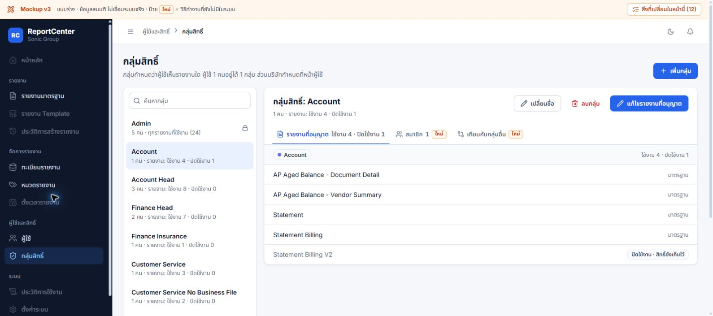

# ReportCenter — Mockup v3

วันที่ 2 ต.ค. 2026 · **ผู้ใช้อนุมัติปรับแบบตามข้อเสนอ 6 ข้อและ keyboard; ทำแล้วเฉพาะ local mock**

แบบโต้ตอบได้ 5 หน้า: รายงานมาตรฐาน, ทะเบียนรายงาน, หมวดรายงาน, ผู้ใช้ และกลุ่มสิทธิ์ ต่อยอดจาก v2 หลังแก้ F1–F3 โดยรักษาการยืนยันก่อนทิ้ง draft และชั้น dialog ที่แก้แล้ว ดู [ข้อเสนอที่อนุมัติ](../2026-10-02-next-ui-refinements.md), [Decision log](../../12_DECISION_LOG.md) และ [ผลแก้ข้อ 1](../../audits/2026-10-02-design-v2/fix-1/README.md)



## เปิดแบบในเครื่อง

รันใน PowerShell แล้วเปิด [รายงานมาตรฐาน](http://127.0.0.1:5195/#standard):

```powershell
python -m http.server 5195 --bind 127.0.0.1 --directory "D:\Antigravity\reportcenter\docs\design\2026-10-02-mockups-v3"
```

หน้าอื่นใช้ `#reports`, `#categories`, `#users` และ `#roles` ต่อท้าย `http://127.0.0.1:5195/` หยุด server ด้วย Ctrl+C

ข้อมูลจาก [data.js](data.js) เป็นข้อมูลสมมติ ชื่อรายงานอ้างอิง catalog เดิม แต่คน การจับคู่สิทธิ์ และตัวเลขไม่ใช่ข้อมูลจริง การเพิ่ม/แก้/ลบ เปลี่ยนสิทธิ์ รายการโปรด และประวัติใช้งานเกิดในหน่วยความจำและกลับค่าเริ่มต้นเมื่อ refresh; เฉพาะธีมเก็บใน `localStorage` ด้วย key `rc-mock-theme` แบบนี้ไม่เชื่อม API, ฐานข้อมูล หรือ AD และปุ่มส่งออกยังเป็นข้อความจำลอง ไม่สร้างไฟล์รายงานจริง ส่วน font และไอคอนใน [index.html](index.html) โหลดจากภายนอก

## สิ่งที่ปรับตามข้อเสนอ

| ข้อ | พฤติกรรมใน v3 | Source |
|---|---|---|
| 1. บริบทหมวดรายงาน | หัวรายละเอียดเป็น “หมวดรายงาน: Account”; สร้างหมวดมีการ์ดและหัวข้อของตนเอง ซ่อนรายละเอียด/ปุ่มของหมวดเดิมระหว่างสร้าง และคง guard ก่อนทิ้ง draft | [page-categories.js](page-categories.js) |
| 2. ความหมายกลุ่มสิทธิ์และจำนวน | ใช้ “กลุ่มสิทธิ์: Account”; แสดงจำนวนใช้งานและปิดใช้งานแยกกันให้ตรงกันในรายการ/หัวข้อ/แท็บ; แท็บเทียบระบุว่านับเฉพาะรายงานที่ใช้งาน ไม่ใช้ 100% รับรองว่าสิทธิ์ทุกด้านเท่ากัน | [page-roles.js](page-roles.js) |
| 3. ขอบเขตเลือกรายงานเข้ากลุ่ม | แสดง “เลือกทั้งหมด X · อยู่ในผลค้นหา Y”; เมื่อค้นหา ปุ่มเลือก/ยกเลิกตามหมวดระบุ “ในผลค้นหานี้” และคงรายการที่เลือกนอกผลค้นหา | [page-roles.js](page-roles.js) |
| 4. สรุปก่อนบันทึกผู้ใช้ | สร้างผู้ใช้และแก้ผู้ใช้มีสรุปสด: กลุ่มสิทธิ์เดียว จำนวนรายงานที่ใช้งาน และรหัสบริษัทที่เลือก; สถานะยังไม่เลือกแสดงชัด ไม่ใช้บริษัทต้นสังกัด AD แทนบริษัทที่อนุญาต ไม่เพิ่ม wizard หรือเปลี่ยน flow AD/Local | [page-users.js](page-users.js) |
| 5. ดูกลุ่มสิทธิ์ครบจากทะเบียน | ปุ่ม “+N” เปิด dialog รายชื่อครบได้ด้วยเมาส์และคีย์บอร์ด และมี accessible label ระบุจำนวนกลุ่มทั้งหมด | [page-reports.js](page-reports.js) |
| 6. ทางลัดรายงานมาตรฐาน | แถวรายการโปรดยังอยู่หลังเลือกรายงาน คงลำดับ **เลือกรายงาน → บริษัท/เงื่อนไขเฉพาะรายงาน → ดึงข้อมูล → ส่งออก** | [page-reports.js](page-reports.js) |

## Keyboard และ draft

ปรับ dropdown ให้ Escape ปิดแล้วคืน focus และ Tab/Shift+Tab ปิดแล้วเดินต่อไปยัง control ตามลำดับ การเลือกรายงานมาตรฐานรองรับลูกศร/Enter/Escape โดย Escape ไม่เปิดรายการซ้ำทันที การเปลี่ยน checkbox รายงานของกลุ่มหรือบริษัทของผู้ใช้รักษา focus ที่ checkbox เดิมหลัง render ส่วน dialog/drawer ยังคงการยืนยันก่อนทิ้ง draft และการกดปิด/Escape ซ้ำไม่ถือเป็นการยืนยันทิ้งข้อมูล ดู [core.js](core.js), [page-reports.js](page-reports.js), [page-roles.js](page-roles.js) และ [page-users.js](page-users.js)

ระหว่าง browser QA แก้ animation ของ dialog/drawer ใน [mock.css](mock.css) ให้ใช้ fade เพื่อไม่ให้ transform ชั่วคราวเปลี่ยนตำแหน่งอ้างอิงของ dropdown แบบ fixed ที่อยู่ภายใน แล้วตรวจเปิดรายการและ Tab ต่อไปยังบริษัทได้

## ผลตรวจรอบ v3

| การตรวจ | ผล ณ รอบนี้ |
|---|---|
| Node regression ของ mock | **42 passed** จาก `node --test docs/design/2026-10-02-mockups-v3/tests/*.node.cjs`; ครอบคลุม draft, overlay, keyboard, selection/counts, summary ผู้ใช้ และทางลัดรายงาน |
| `npm test` | Runner รายงาน **16 files, 228 passed, 2 todo**; มีการเก็บ tests ซ้ำจาก `.claude` worktree ที่มีอยู่ จึงไม่ใช่ 228 กรณีทดสอบที่ไม่ซ้ำกัน และไม่ใช่หลักฐานว่า mock เชื่อมระบบจริงแล้ว |
| Browser QA v3 | **ผ่าน flow desktop ที่ระบุด้านล่าง** รอบนี้จบที่ viewport 1600 × 709; console warning/error 0 และหน้า roles ไม่มี horizontal overflow ยังไม่ได้ตรวจ mobile |
| Syntax / whitespace | `node --check` ผ่านไฟล์ `.js` ของ mock ทั้งหมด และ `git diff --check` ผ่านในรอบนี้ |
| ระบบจริง / deployment / UAT | ไม่อยู่ในขอบเขตการปรับ mock รอบนี้ ไม่มีข้อสรุปใหม่ |

ชุดทดสอบอยู่ใน [tests](tests/): `category-draft.node.cjs`, `overlay-draft.node.cjs`, `role-draft.node.cjs`, `keyboard.node.cjs`, `report-interactions.node.cjs`, `roles-refinements.node.cjs` และ `user-summary.node.cjs`

### Browser QA และภาพรอบนี้

| Flow ที่ตรวจ | ผลและภาพ |
|---|---|
| กลุ่มสิทธิ์ | ค้น GL เห็นเลือกทั้งหมด 6 / ในผลค้นหา 1; Space เปลี่ยน checkbox และ focus ยังอยู่ที่เดิม — [selection](screenshots/01-role-selection.png), [ภาพรวม](screenshots/07-roles-overview.png) |
| หมวดรายงาน | หัวข้อมีบริบทหมวด และหน้าสร้างแยกการ์ดโดยไม่แสดงรายละเอียด/ปุ่มหมวดเดิม — [รายละเอียด](screenshots/02-category-context.png), [สร้างหมวด](screenshots/03-category-create.png) |
| ผู้ใช้ | สร้างผู้ใช้กลุ่ม Account แสดงรายงานใช้งาน 4 กับบริษัท SNI/GRL; ฟอร์มแก้ไขอัปเดตสรุปตามค่าที่เลือก; dropdown และ Tab ไปยังบริษัทได้ — [สรุปก่อนบันทึก](screenshots/04-user-access-summary.png) |
| รายงานมาตรฐาน | เริ่มต้นซ่อนบริษัท; Escape ปิดตัวเลือกรายงานและคลิกเปิดใหม่ได้; เลือก AP แสดงเงื่อนไขวันที่และดึงผลจำลอง 1,284 แถว; สลับ GL แล้วยังเห็นรายการโปรด — [เงื่อนไขรายงาน](screenshots/05-report-conditions.png) |
| ทะเบียนรายงาน | Enter ที่ “+1” เปิดชื่อกลุ่มครบ 3 กลุ่ม และ Escape กลับ focus ที่ปุ่มเดิม — [dialog กลุ่มสิทธิ์](screenshots/06-report-access-groups.png) |

ผลนี้รับรองเฉพาะ flow ของ mock ที่ตรวจ ไม่ใช่ผลเรียกรายงาน บันทึกผู้ใช้ หรือบังคับสิทธิ์ผ่าน backend จริง ภาพเป็นหลักฐานหน้าจอประกอบการทดลอง ไม่ใช่หลักฐาน interaction ทุกจังหวะ

## ข้อจำกัด F7 ที่ยังคงเดิม

การอนุมัติหน้าตาไม่ใช่อนุมัติเปลี่ยนกฎหรือรับรอง backend ให้ตรงแบบ ข้อแตกต่างจาก [audit F7](../../audits/2026-10-02-design-v2/README.md) ยังไม่ได้แก้ในรอบนี้:

| เรื่อง | ข้อจำกัดที่ต้องคงไว้เมื่อพัฒนาระบบจริง |
|---|---|
| เงื่อนไขรายงาน | Mock ยังมี required และ regex ตามชื่อ period; [parameters API](../../../src/app/api/reports/parameters/route.js) ไม่มี required/validation rule และ [Standard จริง](<../../../src/app/(dashboard)/reports/standard/page.tsx>) ถามยืนยันเมื่อเว้นว่าง ต้องยึด definition ของแต่ละ Report ไม่อนุมานกฎทุก Report จาก mock |
| ไฟล์ส่งออก | Mock เขียน Excel `.xlsx` และจำลองข้อความ; Standard จริงส่ง `.xlsb` ส่วน [heavy report](../../../src/app/api/reports/execute-async/route.js) ส่ง `.csv` ยังไม่ได้ตัดสินใจเปลี่ยนชนิดไฟล์ |
| ลบรายงาน / สิทธิ์รายงานปิดใช้งาน | ข้อความลบกำหนดการพร้อมรายงาน และการเก็บ mapping เมื่อปิดใช้งานใน mock ยังมี gap กับ API ตาม F7 ต้องกำหนดและทดสอบก่อนนำไปใช้จริง |
| บริษัทและ guard ผู้ใช้ | สรุปบริษัท/สิทธิ์ใน UI ไม่รับรองการบังคับสิทธิ์ฝั่ง API การกันล็อกตัวเอง หรือการบังคับเปลี่ยนรหัสผ่าน |

ผู้ใช้ยืนยันว่าอีเมลและระบบตั้งเวลาใช้งานได้อยู่แล้ว; รอบนี้ไม่ได้ทดสอบซ้ำหรือเปลี่ยนข้อสรุปนั้น และไม่เพิ่ม stale banner หรือเปลี่ยนความหมาย “ดึงข้อมูล” เป็น “แสดงตัวอย่าง”

## เอกสารที่ทวนประกอบ source

- [DEVELOPER_HANDOFF.md](../../../DEVELOPER_HANDOFF.md): ตาราง Roles/ReportParameters/ReportRoleMapping/UserCompanyMapping และ Standard Report Selector — ใช้อธิบายโครงสร้างเดิม ไม่ใช้รับรองพฤติกรรมใหม่ใน mock
- [Report selector design](../../superpowers/specs/2026-08-14-standard-report-selector-design.md): searchable combobox, keyboard และคง favorites; ไม่เปลี่ยน API/permission/parameters/export และ recent-report persistence อยู่นอก scope
- [Decision log](../../12_DECISION_LOG.md): workflow ตามผู้ใช้และขอบเขตการอนุมัติรอบนี้
- [Audit v2](../../audits/2026-10-02-design-v2/README.md): ข้อแตกต่าง F7 กับระบบจริง; [ข้อเสนอ 6 ข้อ](../2026-10-02-next-ui-refinements.md): เหตุผลก่อนปรับ v3
